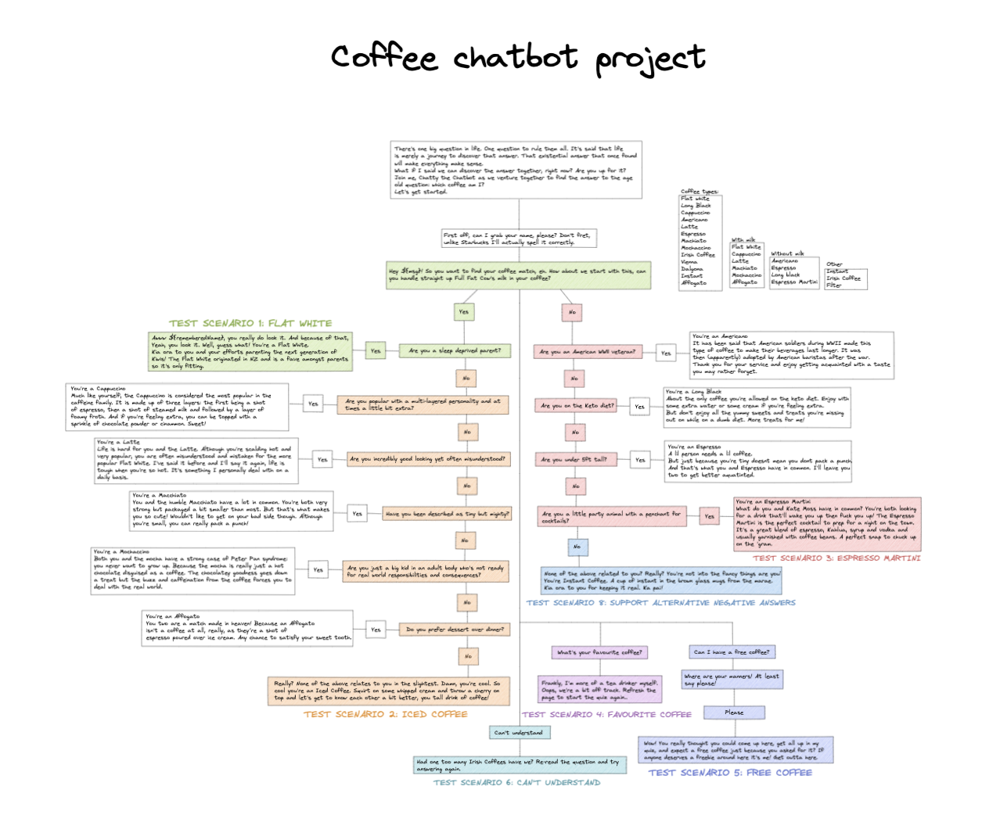

# What coffee am I? - Chatbot Project

### Project Overview

Design and build a chatbot that helps the customer figure out what type of coffee they are. The customer will be able to enter text into a form, and the chatbot should analyse the text, respond accordingly, and pair the customer up with their matching coffee.

#### Design Components

- Page design
- Chatbot logic and copywriting

#### Technical Components

- Single HTML Page
- Custom styling
- Mobile-responsive

#### Preview Images

#### Contact Me

If you would like to discuss this project, or if you have another project you'd like to work with me on, please feel free to [contact me.](https://github.com/ReganMoyes)
